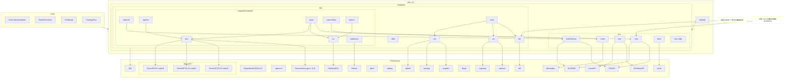

# 依赖库版本

MVS:4.5.1

## 组件库模块依赖图

```mermaid
graph TD
  classDef noteStyle fill:white,stroke:yellow,stroke-width:1px,font-size:12px,color:black;

  subgraph "ThirdLibrary"
    MVSSDK["MVSSDK"]
    DSSDK["DSSDK"]
    HalconSDK["Halcon"]
    Onnxruntime-gpu-1.12.0["Onnxruntime-gpu-1.12.0"]
    subgraph "TensorRT"
        TensorRT10.12-cuda12["TensorRT10.12-cuda12"]
        TensorRT10.12-cuda11["TensorRT10.12-cuda11"]
        TensorRT8.6-cuda11["TensorRT8.6-cuda11"]
    end
    VisionMasterSDK4.4.0["VisionMasterSDK4.4.0"]
    ZMotionSDK["ZMotionSDK"]
    opencv4["opencv4"]
    pugixml["pugixml"]
    jsoncpp["jsoncpp"]
    sqlite3["sqlite3"]
    gtest["gtest"]
    spdlog["spdlog"]
    cryptopp["cryptopp"]
    openssl["openssl"]
    libmodbus["libmodbus"]
    libzip["libzip"]
    std["std"]
    WindowsAPI["WindowsAPI"]
    LinuxAPI["LinuxAPI"]
    serial["serial"]
    Qt6["Qt6"]
  end

  subgraph "RW_UL"
    fundation["Module"]
    subgraph "fundation"
        cla["cla"]
        cla --> openssl
        cla --> cryptopp


        dsl["dsl"]
        dsl --> std

        ime["ime"]
        ime --> Onnxruntime-gpu-1.12.0
        ime --> TensorRT10.12-cuda12
        ime --> TensorRT10.12-cuda11
        ime --> TensorRT8.6-cuda11

        oso["oso"]
        oso --> pugixml
        oso --> jsoncpp
        oso --> sqlite3

        scc["scc"] 
        scc --> ZMotionSDK

        utilty["utilty"]

        subgraph "hoe"
            hoec["hoec"]
            hoec --> DSSDK
            hoec --> MVSSDK

            hoeRefactor["hoeRefactor"]
            hoeRefactor --> DSSDK
            hoeRefactor --> MVSSDK


            hoei["hoei"]
            hoei --> WindowsAPI
            hoei --> LinuxAPI

            hoem["hoem"]
            hoem --> libmodbus

            hoes["hoes"]
            hoes --> serial


            hoe::utilty["hoe::utilty"]
        end

        subgraph "rqw"
            main["main"]
            main --> dsl
            main --> cla
            main --> oso

            utilty["utilty"]

            subgraph "expandComponet"
                rqwhalcon["rqwhalcon"]
                rqwhalcon --> HalconSDK

                rqwhoec["rqwhoec"]
                rqwhoec --> hoeRefactor

                rqwime["rqwime"]
                rqwime --> ime

                rqwm["rqwm"]
                rqwm --> hoec
                rqwm --> scc
                rqwm --> ime

                rqwmodbus["rqwmodbus"]
                rqwmodbus --> hoem

                rqwscc["rqwscc"]
                rqwscc --> scc

            end 
        end 

        rqw --> Qt6
    end
    Module --> fundation
  end

  subgraph "tools"
    direction TB
    AutomaticAnnotation["AutomaticAnnotation"]
    ModelConverter["ModelConverter"]
    XmlMerge["XmlMerge"]
    PackageTool["PackageTool"]
  end

  tools --> RW_UL


  Notedsl["说明: dsl 封装了一些复杂的数据结构"] --> dsl

  Notehoec["说明：hoec 已经弃用请使用hoecRefactor"] --> hoec
  
  class Notedsl,Notehoec noteStyle
```
