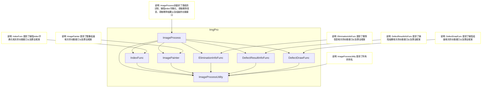
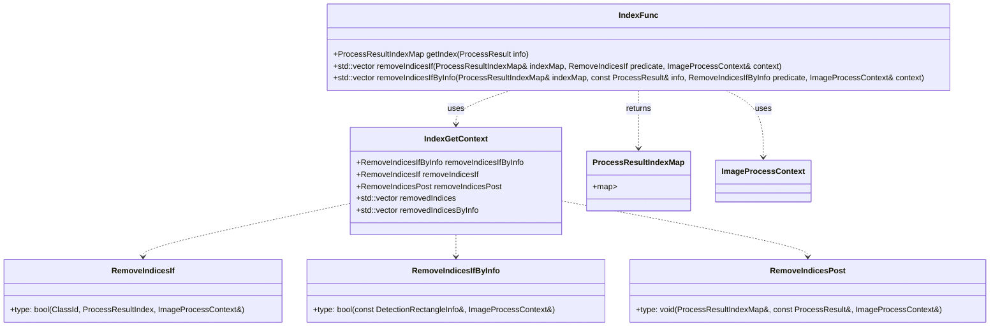

# ImgPro 模块库说明文档 

## 介绍
封装了若干个可复用的业务逻辑模块，提供给视觉检测项目、工业剔除项目使用。

## 目录结构
```
ImgPro/
├── include/                  # 模块头文件
├── src/                      # 模块源代码
├── test/                     # 模块测试代码
├── testQt/                   # 模块测试代码（Qt 版本）
├── CMakeLists.txt            # CMake 构建配置文件
└── README.md                 # 项目说明文件
```

## 组件概览图


## 组件说明
### IndexFunc 缺陷index字典化组件

#### 概要
`IndexFunc` 负责将检测结果（`ProcessResult`，按元素包含 `classId` 等信息）字典化为按 `ClassId` 分组的索引集合（`ProcessResultIndexMap`），并提供基于条件的索引删除与后处理接口。该组件保持无状态（所有接口静态），便于在流水线中按需调用与单元测试。

#### 类 / 接口 示意图（类图风格）



#### 算法框架图（流程图）

```mermaid
flowchart TD
  A["Start: 输入 ProcessResult(info)"] --> B["getIndex(info)\n- 遍历 info\n- result&#91;classId&#93;.insert(index)"]
  B --> C{"是否需要删除索引？"}
  C -->|基于 index 值| D["removeIndicesIf(indexMap, predicate, context)\n- 遍历每个 classId 的 index set\n- predicate(classId, index, ctx) -> 删除并记录"]
  C -->|基于 info 内容| E["removeIndicesIfByInfo(indexMap, info, predicate, context)\n- 访问 info[index]\n- predicate(info[idx], ctx) -> 删除并记录"]
  C -->|否| F["无需删除：跳到后处理"]
  D --> G["可选：removeIndicesPost(indexMap, info, context)"]
  E --> G
  F --> G
  G --> H["返回：更新后的 indexMap 与 已删除索引列表"]
  H --> I["End"]
```



关键步骤说明
- 构建索引：`getIndex` 以 `classId` 为键，将所有结果索引聚合到集合中（便于按类别快速筛选与删除）。  
- 条件删除：提供两种删除方式 ―― 基于索引值（`RemoveIndicesIf`）或基于检测项信息（`RemoveIndicesIfByInfo`）；两者都在遍历时安全地从 set 中擦除并记录被删除索引。  
- 后处理钩子：`RemoveIndicesPost` 可用于在删除后统一执行额外操作（比如日志、合并、统计等）。

#### 设计理念与权衡
- 无状态静态接口：避免对象生命周期管理，便于在多线程流水线或工具函数中直接调用。  
- 将索引按 `ClassId` 分组：加速按类别筛选、便于并行或分批处理（每个 class 一组）。  
- 提供两类删除策略：
  - 基于 `ClassId` + `index` 的 predicate：当删除条件只依赖索引编号或分类策略时高效（避免再次读 info）。  
  - 基于 `info[index]` 的 predicate：当删除条件需要检测框、置信度或其他检测结果字段时使用。  
- 删除实现对容器（set）进行就地擦除并返回被删除项，保证上层能获得变更历史用于日志或回滚。  
- 可扩展性：通过 `IndexGetContext` 聚合多个回调（remove、post 等），便于将来加并发过滤、策略链或统计回调。

#### 使用建议
- 当删除条件仅与类 ID 或外部策略相关，优先使用 `removeIndicesIf`（避免重复访问检测信息）。  
- 当删除条件需要读取检测框、置信度或位置信息时，使用 `removeIndicesIfByInfo` 并传入当前 `ProcessResult`。  
- 若需在删除后做额外处理（比如合并跨类索引、生成剔除报告），通过 `RemoveIndicesPost` 注入实现。

#### 示例伪代码

```cpp
// 典型调用流程（伪代码） 
auto idxMap = IndexFunc::getIndex(processResult);
ImageProcessContext ctx = ...; 
auto removed = 
    IndexFunc::removeIndicesIfByInfo(
        idxMap,
        processResult, 
        [](const DetectionRectangleInfo& info, ImageProcessContext& ctx){ 
        return info.confidence < ctx.minConfidence; 
        }, 
        ctx
        );
// 可选：后处理 if (somePostProcessing) { ctx.someData = ...; // 使用 idxMap / removed 进一步处理 }
IndexFunc::removeIndicesPost(idxMap, processResult, ctx);
```