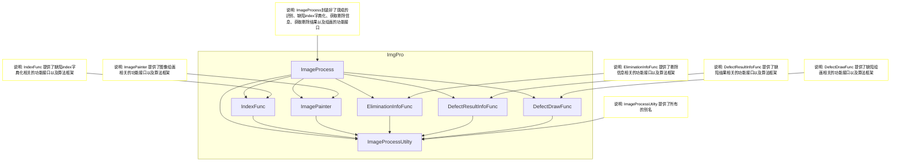

# ImgPro 模块库说明文档 

## 介绍
封装了若干个可复用的业务逻辑模块，提供给视觉检测项目、工业剔除项目使用。

## 目录结构
```
ImgPro/
├── include/                  # 模块头文件
├── src/                      # 模块源代码
├── test/                     # 模块测试代码
├── testQt/                   # 模块测试代码（Qt 版本）
├── CMakeLists.txt            # CMake 构建配置文件
└── README.md                 # 项目说明文件
```

## 组件概览图


## 组件说明
### IndexFunc 缺陷index字典化组件