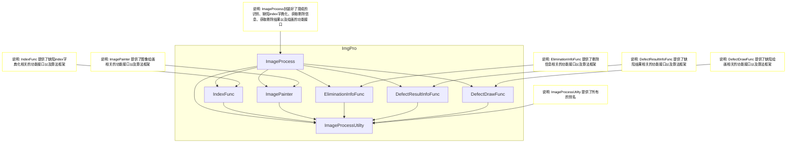
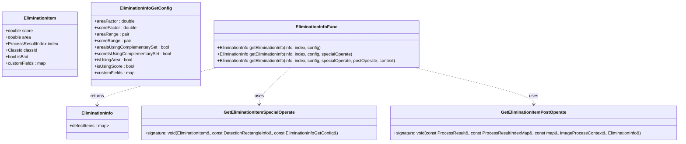
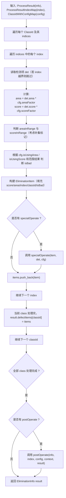
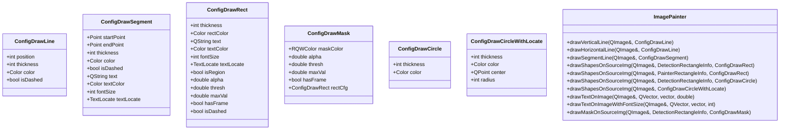

```mermaid
classDiagram
  class DefectResultInfo {
    +bool isBad
    +defects : map<ClassId, vector<EliminationItem>>
    +disableDefects : map<ClassId, vector<EliminationItem>>
  }

  class DefectResultGetConfig {
    +bool isEnable
  }

  class DefectResultInfoFunc {
    +getDefectResultInfo(eliminationInfo, config, getDefectResultExtraOperate, getDefectResultExtraOperateDisable, processResult)
    +getDefectResultInfo(processResult, classIdWithEliminationInfoConfigMap, eliminationInfo, config, getDefectResultExtraOperate, getDefectResultExtraOperateDisable, getDefectResultExtraOperateWithFullInfo)
    +getDefectResultInfo(processResult, classIdWithEliminationInfoConfigMap, eliminationInfo, config, getDefectResultExtraOperate, getDefectResultExtraOperateDisable, getDefectResultExtraOperateWithFullInfo, getDefectResultExtraPostOperate, context)
  }

  class GetDefectResultExtraOperateWhichIsDefects {
    +signature: void(const EliminationItem&, const DetectionRectangleInfo&)
  }

  class GetDefectResultExtraOperateWhichIsDisableDefects {
    +signature: void(const EliminationItem&, const DetectionRectangleInfo&)
  }

  class GetDefectResultExtraOperateWithFullInfo {
    +signature: void(const DetectionRectangleInfo&, const EliminationInfoGetConfig&, const EliminationItem&, const DefectResultGetConfig&, DefectResultInfo&, ImageProcessContext&)
  }

  class GetDefectResultExtraPostOperate {
    +signature: void(const ProcessResult&, const ClassIdWithEliminationInfoConfigMap&, const EliminationInfo&, const ClassIdWithDefectResultInfoFuncConfigMap&, DefectResultInfo&, ImageProcessContext&)
  }

  DefectResultInfoFunc ..> DefectResultInfo : returns
  DefectResultInfoFunc ..> GetDefectResultExtraOperateWhichIsDefects : uses
  DefectResultInfoFunc ..> GetDefectResultExtraOperateWhichIsDisableDefects : uses
  DefectResultInfoFunc ..> GetDefectResultExtraOperateWithFullInfo : uses
  DefectResultInfoFunc ..> GetDefectResultExtraPostOperate : uses
```

# ImgPro 模块库说明文档 

## 介绍
封装了若干个可复用的业务逻辑模块，提供给视觉检测项目、工业剔除项目使用。

## 目录（Table of Contents）

- [介绍](#介绍)
- [目录结构](#目录结构)
- [组件概览图](#组件概览图)
- [组件说明](#组件说明)
  - [IndexFunc 缺陷index字典化组件](#indexfunc-缺陷index字典化组件)
    - [概要](#概要)
    - [类 / 接口 示意图（类图风格）](#类--接口-示意图类图风格)
    - [算法框架图（流程图）](#算法框架图流程图)
    - [使用建议](#使用建议)
  - [ImageProcessUtilty 图像处理工具组件](#imageprocessutilty-图像处理工具组件)
  - [EliminationInfoFunc 剔除信息组件](#eliminationinfofunc-剔除信息组件)
    - [概要](#概要-1)
    - [类 / 接口 示意图（类图风格）](#类--接口-示意图类图风格-1)
    - [算法框架图（流程图）](#算法框架图流程图-1)
  - [DefectResultInfoFunc 缺陷结果组件](#defectresultinfofunc-缺陷结果组件)
    - [概要](#概要-2)
    - [类图（classDiagram）](#类图classdiagram)
    - [算法框架图（flowchart TD）](#算法框架图flowchart-td)
  - [DefectDrawFunc 缺陷绘画组件](#defectdrawfunc-缺陷绘画组件)
    - [概要](#概要-3)
    - [类图（classDiagram）](#类图classdiagram-1)
    - [算法流程（flowchart TD）](#算法流程flowchart-td)
  - [ImagePainter 图像绘画组件](#imagepainter-图像绘画组件)
    - [概要](#概要-4)
    - [类图（classDiagram）](#类图classdiagram-2)
    - [关键实现要点](#关键实现要点)
  - [ImageProcess 图像处理集合组件](#imageprocess-图像处理集合组件)
    - [概要](#概要-5)
    - [类图（classDiagram）](#类图classdiagram-3)
    - [流程图（flowchart TD）](#流程图flowchart-td)
- [使用示例与片段](#使用示例与片段)


## 目录结构
```
ImgPro/
├── include/                  # 模块头文件
├── src/                      # 模块源代码
├── test/                     # 模块测试代码
├── testQt/                   # 模块测试代码（Qt 版本）
├── CMakeLists.txt            # CMake 构建配置文件
└── README.md                 # 项目说明文件
```

## 组件概览图


## 组件说明
### IndexFunc 缺陷index字典化组件

#### 概要
`IndexFunc` 负责将检测结果（`ProcessResult`，按元素包含 `classId` 等信息）字典化为按 `ClassId` 分组的索引集合（`ProcessResultIndexMap`），并提供基于条件的索引删除与后处理接口。该组件保持无状态（所有接口静态），便于在流水线中按需调用与单元测试。

#### 类 / 接口 示意图（类图风格）


#### 算法框架图（流程图）



```mermaid
flowchart TD
  A["Start: 输入 ProcessResult(info)"] --> B["getIndex(info)\n- 遍历 info\n- result&#91;classId&#93;.insert(index)"]
  B --> C{"是否需要删除索引？"}
  C -->|基于 index 值| D["removeIndicesIf(indexMap, predicate, context)\n- 遍历每个 classId 的 index set\n- predicate(classId, index, ctx) -> 删除并记录"]
  C -->|基于 info 内容| E["removeIndicesIfByInfo(indexMap, info, predicate, context)\n- 访问 info[index]\n- predicate(info[idx], ctx) -> 删除并记录"]
  C -->|否| F["无需删除：跳到后处理"]
  D --> G["可选：removeIndicesPost(indexMap, info, context)"]
  E --> G
  F --> G
  G --> H["返回：更新后的 indexMap 与 已删除索引列表"]
  H --> I["End"]
```

关键步骤说明
- 构建索引：`getIndex` 以 `classId` 为键，将所有结果索引聚合到集合中（便于按类别快速筛选与删除）。  
- 条件删除：提供两种删除方式 —— 基于索引值（`RemoveIndicesIf`）或基于检测项信息（`RemoveIndicesIfByInfo`）；两者都在遍历时安全地从 set 中擦除并记录被删除索引。  
- 后处理钩子：`RemoveIndicesPost` 可用于在删除后统一执行额外操作（比如日志、合并、统计等）。

#### 设计理念与权衡
- 无状态静态接口：避免对象生命周期管理，便于在多线程流水线或工具函数中直接调用。  
- 将索引按 `ClassId` 分组：加速按类别筛选、便于并行或分批处理（每个 class 一组）。  
- 提供两类删除策略：
  - 基于 `ClassId` + `index` 的 predicate：当删除条件只依赖索引编号或分类策略时高效（避免再次读 info）。  
  - 基于 `info[index]` 的 predicate：当删除条件需要检测框、置信度或其他检测结果字段时使用。  
- 删除实现对容器（set）进行就地擦除并返回被删除项，保证上层能获得变更历史用于日志或回滚。  
- 可扩展性：通过 `IndexGetContext` 聚合多个回调（remove、post 等），便于将来加并发过滤、策略链或统计回调。

#### 使用建议
- 当删除条件仅与类 ID 或外部策略相关，优先使用 `removeIndicesIf`（避免重复访问检测信息）。  
- 当删除条件需要读取检测框、置信度或位置信息时，使用 `removeIndicesIfByInfo` 并传入当前 `ProcessResult`。  
- 若需在删除后做额外处理（比如合并跨类索引、生成剔除报告），通过 `RemoveIndicesPost` 注入实现。

#### 示例伪代码

```cpp
// 典型调用流程（伪代码） 
auto idxMap = IndexFunc::getIndex(processResult);
ImageProcessContext ctx = ...; 
auto removed = 
    IndexFunc::removeIndicesIfByInfo(
        idxMap,
        processResult, 
        [](const DetectionRectangleInfo& info, ImageProcessContext& ctx){ 
        return info.confidence < ctx.minConfidence; 
        }, 
        ctx
        );
// 可选：后处理 if (somePostProcessing) { ctx.someData = ...; // 使用 idxMap / removed 进一步处理 }
IndexFunc::removeIndicesPost(idxMap, processResult, ctx);
```

### ImageProcessUtilty 图像处理工具组件

#### 概要
`ImageProcessUtilty` 提供了本模块内通用的类型别名与轻量工具（类型转换、时间单位、颜色别名等），用以统一接口签名并降低各组件间耦合。核心在于把常用的基础类型集中定义，便于阅读、重构与测试。

#### 主要别名（来自 `imgPro_ImageProcessUtilty.hpp`）
- `ClassId` — 类型别名，代表缺陷类别 id（`size_t`）。  
- `ClassIds` — 类 id 列表（`std::vector<ClassId>`）。  
- `ProcessResult` — 检测结果序列（`std::vector<rw::DetectionRectangleInfo>`）。  
- `ProcessResultIndex` — 检测项索引（`size_t`）。  
- `ProcessResultIndexMap` — 按类分组的索引集合（`std::unordered_map<ClassId, std::set<ProcessResultIndex>>`）。  
- `ClassIdName` — 类名字符串（`QString`）。  
- `RunTime` — 运行时度量类型（`unsigned long long`），用于记录毫秒级耗时。  
- `Color` — 颜色类型别名（`rw::rqw::RQWColor`）。

#### 常见用法与建议
- 类型统一：在模块外部使用 `ProcessResult` / `ProcessResultIndexMap` 等别名可以避免直接依赖内部实现容器，便于未来把 `std::set` 换为其他容器。  
- 索引语义：`ProcessResultIndex` 与 `ProcessResult` 的长度紧耦合，使用前应验证索引是否越界。  
- 线程与所有权：`ProcessResult` 为值语义（`vector`），在高并发场景下应避免不必要拷贝 — 可传 `const &` 或使用移动语义。`QImage` 与 GUI 绘制必须在主线程或已加锁的上下文中操作。  
- 运行时单位：`RunTime` 用于毫秒计时，记录与展示要统一格式（见 `DefectDrawFunc::RunTextConfig` 用例）。

### EliminationInfoFunc 剔除信息组件

#### 概要
`EliminationInfoFunc` 根据 `ProcessResult` 与 `ProcessResultIndexMap`、按每个 `ClassId` 的配置（`EliminationInfoGetConfig`）计算每个检测项的 `EliminationItem`（`score`、`area`、`isBad` 等），支持单项特殊处理 `specialOperate` 与全局后处理 `postOperate`，最终返回按类分组的 `EliminationInfo`。

#### 类 / 接口 示意图（类图风格）


#### 算法框架图（流程图）


#### 关键实现要点
- 面积/置信度缩放：通过 `areaFactor` / `scoreFactor` 统一尺度（支持百分制/万分制等）。
- 范围判断：`areaRange` / `scoreRange` 与 `areaIsUsingComplementarySet` / `scoreIsUsingComplementarySet` 可组合成“范围内剔除”或“范围外剔除”策略。
- 可选维度：`isUsingArea` / `isUsingScore` 控制是否以该维度参与剔除判断。
- 扩展点：
    - `specialOperate`：在构造单个 `EliminationItem` 后执行，允许注入自定义字段或复杂判定。
    - `postOperate`：在全部项构造后执行，允许跨类合并、统计或修改 `result`。
- 容错：对越界索引跳过，对缺省配置使用 `EliminationInfoGetConfig()` 的默认值。
- 线程与性能：函数为纯计算（除 `postOperate`、`specialOperate` 外），可按 classId 并行处理以提高吞吐；但并发时需保证 `postOperate` 和 `context` 的线程安全。

#### 设计理念与权衡
- 配置驱动：将剔除策略放入 `EliminationInfoGetConfig`，便于在运行时微调与回放。
- 明确分层：单项处理（local）与全局后处理（global）分离，降低单函数复杂度，便于单元测试。
- 可扩展性：通过 `customFields` 存放任意元数据，避免频繁修改数据结构定义。
- 易于审计：返回结构 `EliminationInfo` 包含每项是否被判定为 `isBad`，便于日志、可视化与回溯。

#### 使用示例（C++ 伪代码）

```cpp
// 准备 config
rw::imgPro::ClassIdWithEliminationInfoConfigMap cfg;
rw::imgPro::EliminationInfoGetConfig commonCfg;
commonCfg.areaFactor = 1.0;
commonCfg.scoreFactor = 1.0;
commonCfg.areaRange = {0.0, 1e6};
commonCfg.scoreRange = {0.0, 1.0};
cfg[myClassId] = commonCfg;

// specialOperate：补充自定义字段
auto special = [](rw::imgPro::EliminationItem& item, const rw::DetectionRectangleInfo& det, const rw::imgPro::EliminationInfoGetConfig& c) {
    item.customFields["aspect_ratio"] = det.width / det.height;
};

// postOperate：统计并标记全局阈值
auto post = [](const ProcessResult& info, const ProcessResultIndexMap& idxMap, const rw::imgPro::ClassIdWithEliminationInfoConfigMap& conf, ImageProcessContext& ctx, rw::imgPro::EliminationInfo& out){
    // 例如统计各类被标记数量
    for (auto &kv : out.defectItems) {
        size_t badCount = std::count_if(kv.second.begin(), kv.second.end(), [](const rw::imgPro::EliminationItem& it){ return it.isBad; });
        // 将统计结果放入 context 或 customFields
    }
};

ImageProcessContext ctx{};
auto result = rw::imgPro::EliminationInfoFunc::getEliminationInfo(processResult, indexMap, cfg, special, post, ctx);
```

### DefectResultInfoFunc 缺陷结果组件

#### 概要
`DefectResultInfoFunc` 基于 `EliminationInfo` 与每类的配置，生成最终的缺陷判定结果 `DefectResultInfo`。组件支持按类可选启用（`DefectResultGetConfig::isEnable`）、在判定过程中注入单项或全信息的扩展回调（`getDefectResultExtraOperate*`）以及全局后处理回调（`getDefectResultExtraPostOperate`）。返回结果包含已启用且被判为坏的缺陷（`defects`）和被禁用/判为非坏的缺陷（`disableDefects`），并通过 `isBad` 汇总帧级坏品标记。

#### 类图（classDiagram）



#### 算法框架图（流程图）
```mermaid
flowchart TD
  Start["输入: EliminationInfo(eliminationInfo)\nClassIdWithConfigMap(config)\nProcessResult(processResult)"] --> ForEachClass["遍历 config 中每个 ClassId"]
  ForEachClass --> FindItems["查找 eliminationInfo.defectItems[classId]"]
  FindItems --> ForEachItem["遍历 items 中的每个 EliminationItem"]
  ForEachItem --> CheckEnable{"cfg.isEnable ?"}
  CheckEnable -->|true| DecideBad["若 item.isBad 则归入 defects 并设置 result.isBad = true\n否则归入 disableDefects"]
  CheckEnable -->|false| DisableAlways["无论 isBad 与否均归入 disableDefects"]
  DecideBad --> ExtraOpSimple{"是否有 getDefectResultExtraOperate 或 getDefectResultExtraOperateDisable ?"}
  ExtraOpSimple -->|有| CallExtraSimple["调用对应回调(item, processResult[item.index])"]
  ExtraOpSimple -->|无| PushItemSimple["将 item 加入对应集合"]
  DisableAlways --> ExtraOpDisable{"是否有 getDefectResultExtraOperateDisable ?"}
  ExtraOpDisable -->|有| CallExtraDisable["调用回调(item, processResult[item.index])"]
  ExtraOpDisable -->|无| PushItemDisable["将 item 加入 disableDefects"]
  CallExtraSimple --> PushItemSimple
  CallExtraDisable --> PushItemDisable
  PushItemSimple --> NextItem["继续下一个 item"]
  PushItemDisable --> NextItem
  NextItem --> EndClass["当前 class 处理完"]
  EndClass --> NextClass["处理下一个 classId"]
  NextClass --> AllDone{"全部 class 处理完成 ?"}
  AllDone -->|是| PostOp{"是否有 getDefectResultExtraPostOperate ?"}
  PostOp -->|有| CallPost["调用 postOperate(processResult, ..., result, context)"]
  PostOp -->|无| ReturnRes["返回 DefectResultInfo result"]
  CallPost --> ReturnRes
 ```

#### 关键实现要点
- 启用控制：按 `DefectResultGetConfig::isEnable` 决定该类是否把 `isBad` 判为缺陷（`defects`）或全部归为 `disableDefects`。  
- 回调扩展：
  - `getDefectResultExtraOperate`：针对被判为缺陷的项，可执行额外操作（如记录、转换）；回调接收 `EliminationItem` 与对应的 `DetectionRectangleInfo`。  
  - `getDefectResultExtraOperateDisable`：针对禁用或非坏项的扩展。  
  - `getDefectResultExtraOperateWithFullInfo`：在有完整消除配置时，允许访问 `EliminationInfoGetConfig`、`DefectResultGetConfig`、结果对象与上下文进行更复杂操作。  
  - `getDefectResultExtraPostOperate`：全局后处理，适用于跨类统计或汇总。  
- 索引安全：使用 `item.index` 从 `processResult` 取对应 `DetectionRectangleInfo` 前应检查越界。  
- 结果聚合：`result.isBad` 一旦任一启用类出现 `item.isBad == true` 则置位，便于快速帧级判定。

#### 设计理念与权衡
- 配置优先：把“是否计入缺陷”的开关交给 `DefectResultGetConfig`，避免在业务代码中硬编码类行为。  
- 回调可插拔：把可变的业务逻辑通过回调暴露，核心函数保持纯粹的聚合与分类职责，便于单元测试与复用。  
- 性能考虑：遍历按类展开，若数据量大可并行处理类间循环，但须保证回调与 `context` 的线程安全性。  
- 审计友好：保留 `disableDefects` 便于后续分析与可视化，而非丢弃非缺陷项。

#### 使用建议与示例（伪代码）

```cpp
// 示例：准备配置并调用 DefectResultInfoFunc

// 1. 准备 class 配置
rw::imgPro::ClassIdWithDefectResultInfoFuncConfigMap cfg;
rw::imgPro::DefectResultGetConfig c;
c.isEnable = true;
cfg[myClassId] = c;

// 2. 可选回调：记录被判为缺陷时的一些行为
auto extraDefect = [](const rw::imgPro::EliminationItem& item,
                      const rw::DetectionRectangleInfo& det)
{
    // 例如：记录日志或填充额外字段
};

// 3. 全局后处理：统计每类缺陷数量
auto post = [](const ProcessResult& processResult,
               const rw::imgPro::ClassIdWithEliminationInfoConfigMap& eliCfg,
               const rw::imgPro::EliminationInfo& eliInfo,
               const rw::imgPro::ClassIdWithDefectResultInfoFuncConfigMap& defectCfg,
               rw::imgPro::DefectResultInfo& out,
               rw::imgPro::ImageProcessContext& ctx)
{
    for (const auto& kv : out.defects) {
        size_t cnt = kv.second.size();
        // 将 cnt 写入 ctx 或日志
    }
};

// 4. 上下文（示例）
rw::imgPro::ImageProcessContext ctx{};

// 5. 调用（注意参数顺序与重载签名）
rw::imgPro::DefectResultInfo res =
    rw::imgPro::DefectResultInfoFunc::getDefectResultInfo(
        processResult,
        classIdWithEliminationInfoConfigMap,
        eliminationInfo,
        cfg,
        extraDefect,   // getDefectResultExtraOperate
        nullptr,       // getDefectResultExtraOperateDisable
        nullptr,       // getDefectResultExtraOperateWithFullInfo
        post,          // getDefectResultExtraPostOperate
        ctx);
```

### DefectDrawFunc 缺陷绘画组件

#### 概要
`DefectDrawFunc` 负责把 `DefectResultInfo` 与对应的 `ProcessResult` 渲染到 `QImage` 上，支持：
- 按类自定义显示颜色、文本位置、字体与线宽；
- 绘制边框或基于分割掩码的填充（mask）；
- 可选的系列运行时文本（时间、额外文本等）；
- 支持每类或整图的后处理钩子（`DefectDrawFuncContext::postOperateFunc`）用于额外图像处理或统计。

组件以配置驱动，提供按类与全局层级的配置覆盖规则，绘制过程调用 `ImagePainter` 完成低层绘制细节。

#### 类图（classDiagram）
```mermaid
classDiagram
  class DefectDrawConfigItem {
    +bool isDisName
    +bool isDisScoreText
    +bool isDisAreaText
    +bool isDrawMask
    +double alpha
    +double thresh
    +double maxVal
    +bool hasFrame
    +int areaDisPrecision
    +int scoreDisPrecision
    +textLocate : ConfigDrawRect::TextLocate
    +int fontSize
    +int thickness
    +defectColorGood : Color
    +defectColorBad : Color
  }

  class DefectDrawConfig {
    +bool isDisName
    +bool isDrawDefects
    +bool isDrawDisableDefects
    +classIdNameMap : unordered_map<ClassId, ClassIdName>
    +isDisScoreText
    +isDisAreaText
    +setAllIdsWithSameColor(ids, color, isGood)
    +classIdWithConfigMap : unordered_map<ClassId, DefectDrawConfigItem>
    +fontSize
    +thickness
    +textLocate : ConfigDrawRect::TextLocate
    +isDrawMask
    +alpha
    +thresh
    +maxVal
    +hasFrame
    +areaDisPrecision
    +scoreDisPrecision
    +classIdIgnoreDrawSet : unordered_set<ClassId>
  }

  class RunTextConfig {
    +bool isDrawExtraText
    +extraTexts : QVector<QString>
    +extraTextColor : Color
    +bool isDisProcessImgTime
    +processImgTimeText : QString
    +processImgTimeTextColor : Color
    +bool isDisOperatorTime
    +operatorTimeText : QString
    +operatorTimeTextColor : Color
    +runTextProportion : double
  }

  class DefectDrawFuncContext {
    +postOperateFunc : DefectDrawFuncPostOperate
    +ignoreItems : unordered_map<ClassId, vector<EliminationItem>>
  }

  class DefectDrawFunc {
    +drawDefectRecs(img, info, processResult, config, context)
    +drawRunText(img, runTextConfig)
  }

  DefectDrawFunc ..> DefectDrawConfig : uses
  DefectDrawFunc ..> RunTextConfig : uses
  DefectDrawFunc ..> DefectDrawFuncContext : uses
  DefectDrawFunc ..> DefectResultInfo : uses
  DefectDrawFunc ..> ProcessResult : uses
  DefectDrawFunc ..> ImagePainter : delegates
````
#### 算法流程（flowchart TD）
```mermaid
flowchart TD
  Start["开始：传入 QImage、DefectResultInfo、ProcessResult、Config、Context"] --> Validate["检查：img 非空 且 processResult 非空"]
  Validate -->|不满足| End["返回（不绘制）"]
  Validate -->|满足| Prepare["准备全局绘制配置（recCfg）并合并每类配置"]
  Prepare --> ForEachClass["遍历每个 classId 及其 EliminationItem 列表"]
  ForEachClass --> CheckIgnore["若 classId 在 classIdIgnoreDrawSet 中，则将 items 加入 context.ignoreItems 并跳过"]
  CheckIgnore --> ForEachItem["遍历 class 的每个 EliminationItem"]
  ForEachItem --> BuildText["根据配置构建显示文本（名称/score/area）"]
  BuildText --> SelectShape["若 proResult.segMaskValid 且 isDrawMask 则 drawMask 否则 drawShapes"]
  SelectShape --> DrawCall["调用 ImagePainter::drawMaskOnSourceImg 或 drawShapesOnSourceImg"]
  DrawCall --> NextItem["下一项"]
  NextItem --> EndClass["当前 class 处理完，写回 result.defectItems[classId]（已绘制）"]
  EndClass --> NextClass["继续下一个 classId"]
  NextClass --> AfterAll["全部 class 处理完成"]
  AfterAll --> PostProcess{"是否有 context.postOperateFunc ?"}
  PostProcess -->|有| DoPost["执行 postOperateFunc(img, context)"]
  PostProcess -->|无| Done["完成绘制"]
  DoPost --> Done
  Done --> DrawRunText{"是否绘制运行时文本？"}
  DrawRunText -->|是| RunText["调用 drawRunText(img, runTextConfig)"]
  DrawRunText -->|否| FinalEnd["结束并返回"]
  RunText --> FinalEnd
```

#### 关键实现要点
- 配置合并：函数先拷贝全局 `ConfigDefectDraw` 到局部 `cfg`，再用 `classIdWithConfigMap` 覆盖对应类的显示参数（颜色、字体、mask 等）。  
- 文本构建：按 `isDisName`、`isDisScoreText`、`isDisAreaText` 组合文本，数值格式由 `areaDisPrecision`、`scoreDisPrecision` 控制。  
- Mask 与 Shape：优先在有有效分割掩码且配置允许时使用 `drawMaskOnSourceImg`（带 alpha 混合），否则使用 `drawShapesOnSourceImg` 绘制矩形/多边形与文本。  
- 忽略集合：`classIdIgnoreDrawSet` 用于全局屏蔽某类绘制，跳过的项会记录到 `context.ignoreItems` 便于后续分析。  
- 后处理钩子：`context.postOperateFunc` 在所有类绘制完成后被调用以做额外图像处理（如加水印、保存或自定义统计可视化）。  
- UI 线程与并发：`QImage` 通常非线程安全，应在合适的线程（UI 或序列化访问）中调用；绘制过程本身可对每类并行但需保证对同一 QImage 的访问受保护或在单线程内进行。

#### 使用示例（C++）
```cpp
// 示例：配置并调用 DefectDrawFunc
rw::imgPro::DefectDrawFunc::ConfigDefectDraw cfg;
cfg.isDrawDefects = true;
cfg.isDrawDisableDefects = false;
cfg.fontSize = 28;
cfg.thickness = 2;
cfg.classIdNameMap[1] = QStringLiteral("孔洞");

rw::imgPro::DefectDrawConfigItem itemCfg;
itemCfg.defectColorBad = Color::Red;
itemCfg.defectColorGood = Color::Green;
cfg.classIdWithConfigMap[1] = itemCfg;

// 准备上下文（可选 postOperate）
rw::imgPro::DefectDrawFuncContext ctx;
ctx.postOperateFunc = [](QImage& img, rw::imgPro::ImageProcessContext&){
    // 示例：保存或附加处理
};

// 绘制（占位变量，请替换为实际数据）
QImage image = /* your image */;
rw::imgPro::DefectResultInfo result = /* your result */;
ProcessResult procRes = /* your process result */;

rw::imgPro::DefectDrawFunc::drawDefectRecs(image, result, procRes, cfg, ctx);

// 绘制运行时文本
rw::imgPro::RunTextConfig rtCfg;
rtCfg.isDrawExtraText = true;
rtCfg.extraTexts = { QStringLiteral("Frame: 123"), QStringLiteral("Elapsed: 12ms") };
rw::imgPro::DefectDrawFunc::drawRunText(image, rtCfg);
```

### ImagePainter 图像绘画组件

#### 概要
`ImagePainter` 提供基础的图像绘制功能，包括在源图像上绘制形状（矩形、多边形）和基于掩码的填充。组件支持自定义颜色、线宽、文本位置与字体大小，适用于视觉检测结果的可视化。

#### 类图（classDiagram）


#### 关键实现要点

- 功能分层：ImagePainter 提供原语级绘制（线、段、圆、OBB 框、多边形区域、文本、掩码），上层（如 DefectDrawFunc）组合使用。
- 文本绘制：对线段文本会按照线段方向、TextLocate 自动计算基点并沿垂直方向偏移以避免覆盖线。矩形文本位置按枚举 TextLocate 选择。
- 掩码绘制：先阈值化 mask，再生成带 alpha 的彩色掩码图并在 ROI 处以 CompositionMode_SourceOver 叠加，最后可附加边框绘制。
- 容错与性能：对越界 ROI / 空 mask 做快速返回；绘制函数内使用 QPainter 并启用抗锯齿（必要时），建议在 UI 线程或确保 QImage 访问线程安全的上下文中调用。
- 可配置性：通过 ConfigDraw* 系列结构灵活控制颜色、线宽、虚线、alpha、阈值与文本样式。

#### 使用示例（C++）
```cpp
    // 简单示例：绘制矩形框和文本
    rw::imgPro::ConfigDrawRect rectCfg;
    rectCfg.thickness = 2;
    rectCfg.rectColor = Color::Red;
    rectCfg.text = QStringLiteral("缺陷A");
    rectCfg.textColor = Color::Red;
    rectCfg.fontSize = 12;
    rectCfg.textLocate = rw::imgPro::ConfigDrawRect::TextLocate::LeftTopOut;
    
    rw::imgPro::DetectionRectangleInfo det = /* 从 ProcessResult 获得 */;
    QImage img = /* 原图 */;
    rw::imgPro::ImagePainter::drawShapesOnSourceImg(img, det, rectCfg);
    
    // 掩码绘制示例
    rw::imgPro::ConfigDrawMask maskCfg;
    maskCfg.maskColor = rw::rqw::RQWColor::Red;
    maskCfg.alpha = 0.35;
    maskCfg.thresh = 0.5;
    maskCfg.rectCfg = rectCfg;
    
    rw::imgPro::ImagePainter::drawMaskOnSourceImg(img, det, maskCfg);
```

### ImageProcess 图像处理集合组件

#### 概要
`ImageProcess` 封装了模型推理、索引构建、剔除信息计算、缺陷判定与可视化（绘制）的一条完整流水线。主要职责：
- 管理 `ModelEngine` 实例并执行 `processImg` 推理；
- 调用 `IndexFunc` 构建按类的索引映射并支持索引过滤回调；
- 调用 `EliminationInfoFunc` 与 `DefectResultInfoFunc` 计算剔除与缺陷结果；
- 通过 `DefectDrawFunc` / `ImagePainter` 将结果渲染到 `QImage`；
- 提供 `ImageProcessContext` 作为全流程配置与状态承载（可注入回调、配置、run-time 信息等）。

组件以 `ImageProcessContext` 为核心共享上下文，便于在流水线中注入策略、回调与显示配置。

#### 类图（classDiagram）

```mermaid
classDiagram
  class ImageProcess {
    +ImageProcess(std::unique_ptr<ModelEngine>& engine)
    +ProcessResult processImg(const cv::Mat& mat)
    +ProcessResultIndexMap getIndex(const ProcessResult& processResult)
    +EliminationInfo getEliminationInfo(const ProcessResult&, const ProcessResultIndexMap&, const EliminationInfoFunc::ClassIdWithConfigMap&)
    +DefectResultInfo getDefectResultInfo(const ProcessResult&, const EliminationInfo&, const DefectResultInfoFunc::ClassIdWithConfigMap&, const EliminationInfoFunc::ClassIdWithConfigMap&)
    +void operator()(const cv::Mat& mat)
    +QImage getMaskImg(const cv::Mat& mat)
  }

  class ImageProcessContext {
    +IndexGetContext indexGetContext
    +EliminationInfoFunc::ClassIdWithConfigMap eliminationCfg
    +EliminationInfoGetContext eliminationInfoGetContext
    +DefectResultInfoFunc::ClassIdWithConfigMap defectCfg
    +DefectResultGetContext defectResultGetContext
    +DefectDrawFunc::ConfigDefectDraw defectDrawCfg
    +DefectDrawFunc::ConfigRunText runTextCfg
    +DefectDrawFuncContext defectDrawFuncContext
    +ImageProcessPrepare imageProcessPrepare
    +RunTime _processImgTime
    +RunTime _operatorTime
  }

  class ModelEngine {
    +ProcessResult processImg(const cv::Mat& mat)
  }

  ImageProcess ..> ImageProcessContext : has
  ImageProcess ..> ModelEngine : uses
  ImageProcess ..> IndexFunc : delegates
  ImageProcess ..> EliminationInfoFunc : delegates
  ImageProcess ..> DefectResultInfoFunc : delegates
  ImageProcess ..> DefectDrawFunc : delegates
 ```

#### 流程图（flowchart TD）

```mermaid
flowchart TD
  Start["Start: 输入 cv::Mat"] --> Prepare["可选：context.imageProcessPrepare(context)"]
  Prepare --> Inference["processImg\n- ModelEngine::processImg\n- 记录 processImgTime"]
  Inference --> Index["getIndex\n- IndexFunc::getIndex\n- 执行 index 过滤回调"]
  Index --> Elimination["getEliminationInfo\n- EliminationInfoFunc::getEliminationInfo"]
  Elimination --> DefectResult["getDefectResultInfo\n- DefectResultInfoFunc::getDefectResultInfo"]
  DefectResult --> Render["getMaskImg\n- DefectDrawFunc::drawDefectRecs\n- drawRunText"]
  Render --> Post["可选 postOperate（context.defectDrawFuncContext.postOperateFunc）"]
  Post --> End["End: 返回渲染图 / 结果"]
```

#### 关键实现要点
- 上下文驱动：所有运行时配置（剔除规则、缺陷启用、绘制样式）保存在 `ImageProcessContext`，便于热更新与回调注入。  
- 可插拔回调：
  - `indexGetContext` 支持 `removeIndicesIf` / `removeIndicesIfByInfo` / `removeIndicesPost`；
  - `eliminationInfoGetContext` 支持 `specialOperate` 与 `postOperate`；
  - `defectResultGetContext` 支持多种单项与全局扩展回调；
  - `defectDrawFuncContext.postOperateFunc` 用于图像级后处理。  
- 性能与并发：推理与后续计算（按 classId）可并行化，但对 `QImage` 的绘制必须保证在单线程或受保护的上下文中进行。  
- 错误与容错：对空模型、空配置或越界索引应抛出或返回默认结果；绘制函数对于空 ROI / 空 mask 做快速返回。  
- 可测试性：各步骤（IndexFunc、EliminationInfoFunc、DefectResultInfoFunc、DefectDrawFunc）均为可独立调用的纯函数/工具，便于单元测试。

#### 使用示例（C++）

```cpp
// 示例：构造并使用 ImageProcess（可直接复制到 README）
std::unique_ptr<rw::ModelEngine> engine = createYourEngine(...);
rw::imgPro::ImageProcess proc(engine);

// 配置上下文（示例）
auto& ctx = proc.context();
// 填充剔除配置：ClassId -> EliminationInfoGetConfig
ctx.eliminationCfg = /* ... */;
// 填充缺陷判定配置：ClassId -> DefectResultGetConfig
ctx.defectCfg = /* ... */;
ctx.defectDrawCfg.fontSize = 24;

// 可选：在处理前准备（每帧回调）
ctx.imageProcessPrepare = [](rw::imgPro::ImageProcessContext& c) {
    // 例如：重置计数、动态调整阈值、记录日志等
};

// 处理一帧（整条流水线）
cv::Mat frame = cv::imread("frame.png");
proc(frame); // 执行：推理 -> 索引 -> 剔除 -> 缺陷判定 -> 绘制等，更新 context 状态

// 获取渲染图（快捷）
QImage vis = proc.getMaskImg(frame);

// 或者单步调用（更灵活）
auto results   = proc.processImg(frame);
auto indexMap  = proc.getIndex(results);
auto eliInfo   = proc.getEliminationInfo(results, indexMap, ctx.eliminationCfg);
auto defectInfo= proc.getDefectResultInfo(results, eliInfo, ctx.defectCfg, ctx.eliminationCfg);
// 静态/实例化接口均可调用
QImage img = rw::imgPro::ImageProcess::getMaskImg(frame, defectInfo, results, ctx, proc.getOperatorTime(), proc.getProcessImgTime());
```

