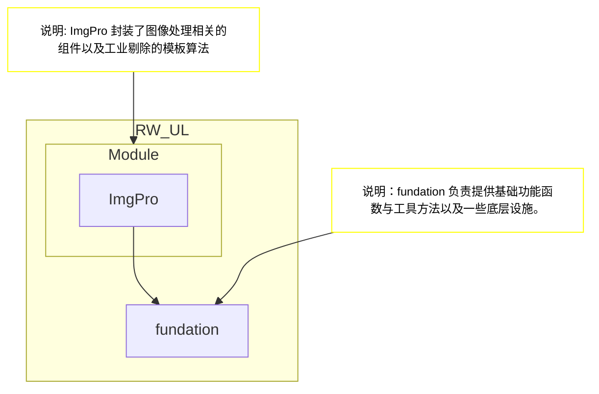

# Module 

## 介绍
封装了若干个可复用的业务逻辑模块，提供给视觉检测项目、工业剔除项目使用。

## 目录结构
```
Module/
├── ImgPro/                  # 图像处理相关组件模块
└── README.md                # 项目说明文件
```

## 组件库模块依赖图

```mermaid
graph TD
  classDef noteStyle fill:white,stroke:yellow,stroke-width:1px,font-size:12px,color:black;

  subgraph "RW_UL"
    fundation["fundation"]
    subgraph "Module"
        ImgPro["ImgPro"] 
    end
    ImgPro --> fundation
  end

  NoteImgPro["说明: ImgPro 封装了图像处理相关的组件以及工业剔除的模板算法"] --> Module

  Notefundation["说明：fundation 负责提供基础功能函数与工具方法以及一些底层设施。"] --> fundation
  
  class NoteImgPro,Notefundation noteStyle
```