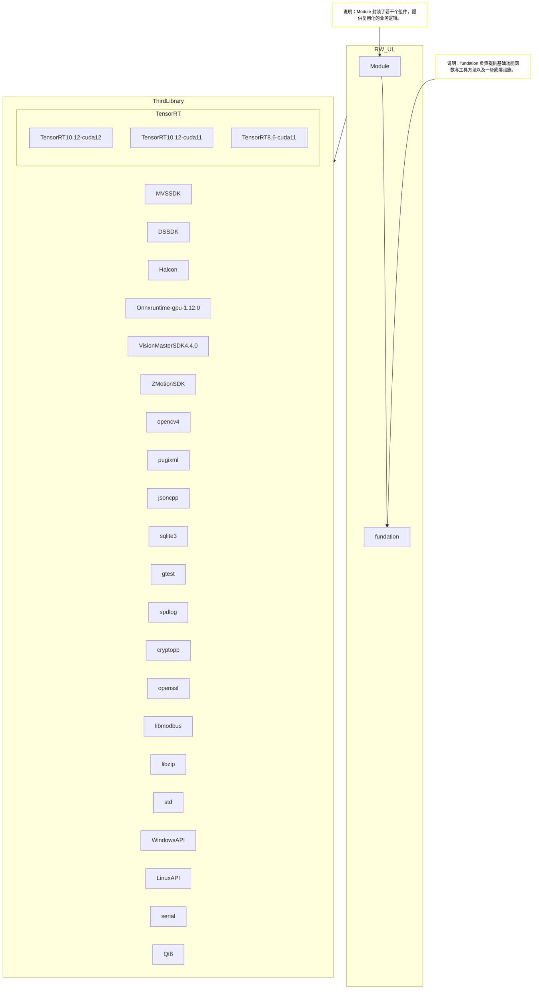

# RW_UL(road wind utilit library) road wind 复用化工具库

## 介绍
RW_UL 是一个专为视觉检测项目、工业剔除项目设计的复用化工具库，旨在提供一套高效、可靠的基础设施和组件，帮助开发者快速构建和维护复杂的应用程序。该库包含了多种实用的工具函数、组件模块以及底层设施，支持项目的可扩展性和可维护性。

## 目录结构
```
RW_UL/
├── fundation/               # 基础设施模块，提供基础功能函数与工具方法
├── Module/                  # 组件模块，封装了若干个可复用的业务逻辑组件
└── README.md                # 项目说明文件
```

## 组件库模块依赖图
